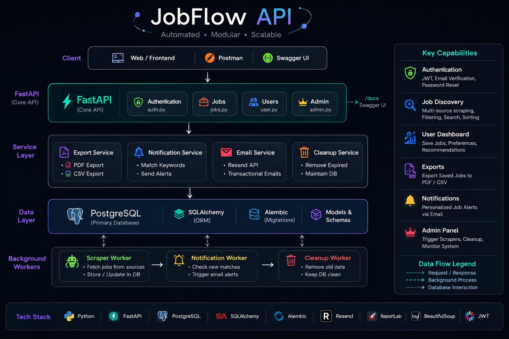
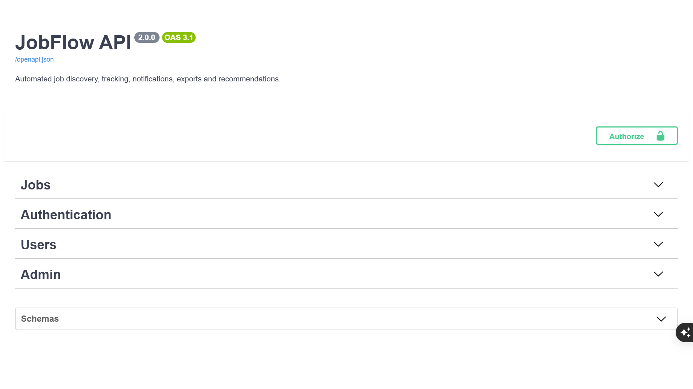
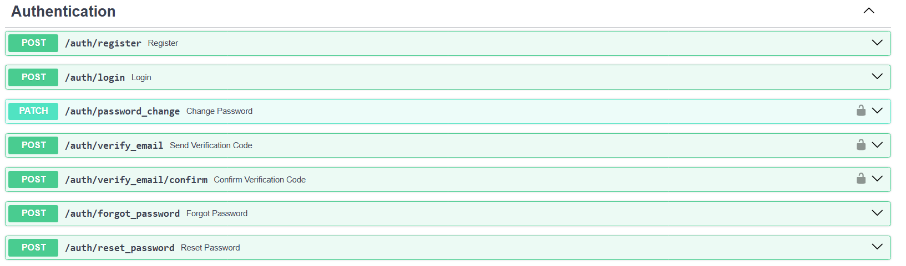
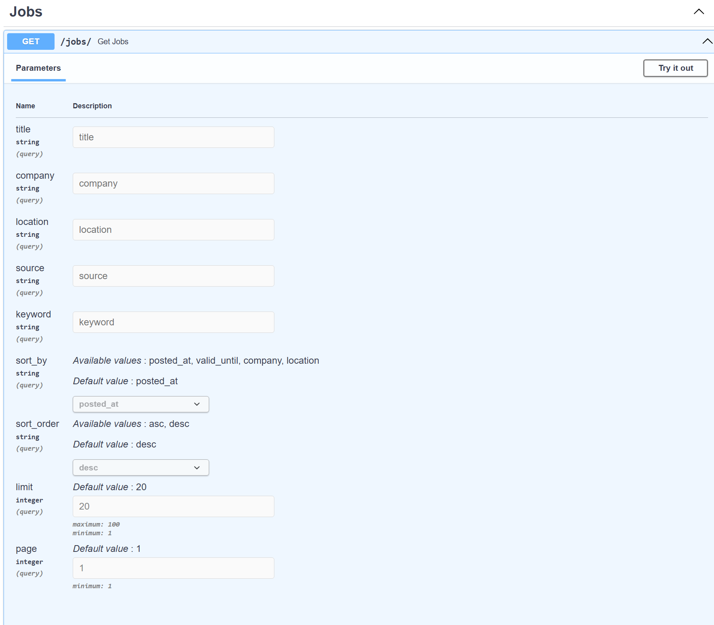
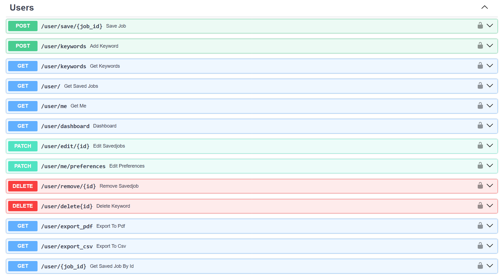
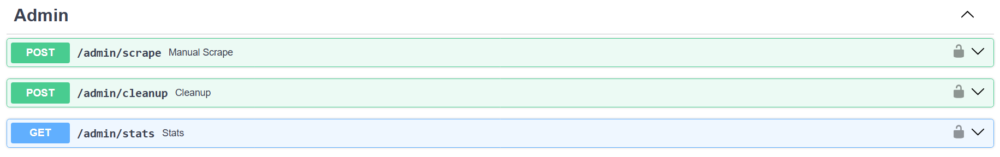
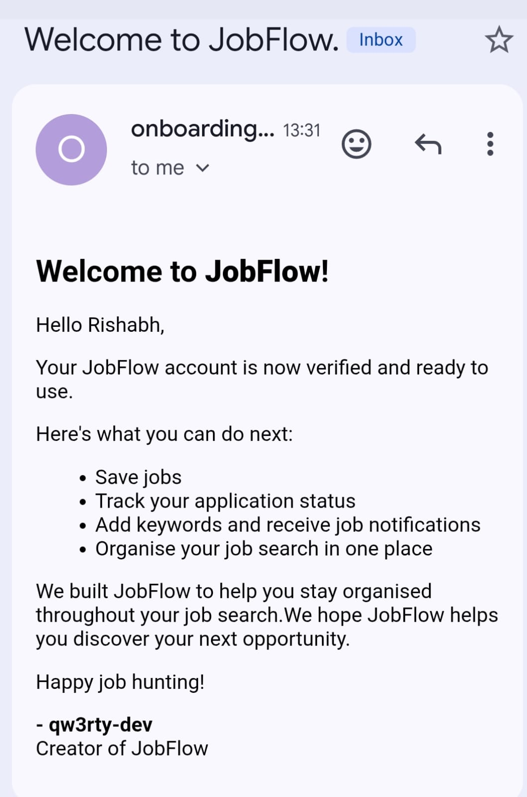
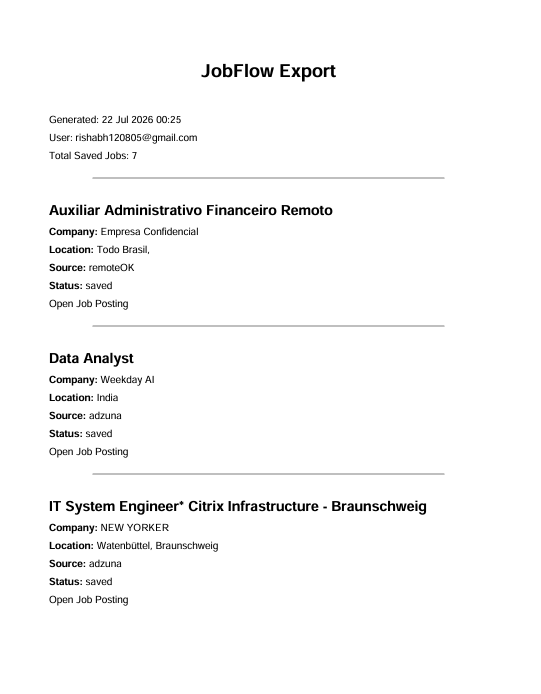
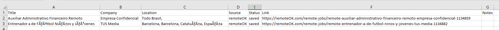

#  JobFlow API

<p align="center">
  
</p>

<p align="center">
Backend API for automated job discovery, tracking, email notifications and PDF/CSV exports.
</p>

<p align="center">


</p>

---

# Overview

JobFlow API is a production-inspired backend application built with **FastAPI** that automates the job search workflow.

Instead of manually searching across multiple websites every day, JobFlow periodically collects jobs from different sources, stores them in PostgreSQL, allows users to manage their applications, and sends email notifications whenever new jobs match their interests.

The project demonstrates real backend engineering concepts including authentication, background workers, database migrations, service-layer architecture, email automation and reporting.

---

# Features

## Authentication

- JWT Authentication
- Secure Password Hashing
- Email Verification
- Password Reset via Email
- Welcome Emails
- Protected Routes

---

## Job Discovery

- Multi-source Job Scraping
- Search Jobs
- Filter by Company, Location and Source
- Sorting
- Pagination

---

## User Features

- Save Jobs
- Track Application Status
- Personal Dashboard
- Manage Keywords
- Notification Preferences
- Export Saved Jobs to PDF
- Export Saved Jobs to CSV

---

## Email Services

- Welcome Email
- Email Verification
- Password Reset Email
- Job Notification Email

---

## Background Workers

- Automated Job Scraper
- Notification Worker
- Cleanup Worker

---

## Database

- PostgreSQL
- SQLAlchemy ORM
- Alembic Migrations
- Relationship Mapping

---

# Architecture

The project follows a layered architecture.

```
Client

↓

FastAPI Routes

↓

Service Layer

↓

SQLAlchemy ORM

↓

PostgreSQL
```

Background workers operate independently from the API and continuously:

- Scrape new jobs
- Notify users
- Cleanup expired data

---

# Tech Stack

| Layer | Technology |
|---------|------------|
| Language | Python |
| Framework | FastAPI |
| Database | PostgreSQL |
| ORM | SQLAlchemy |
| Migrations | Alembic |
| Authentication | JWT |
| Email | Resend |
| Web Scraping | Requests + BeautifulSoup |
| Reports | ReportLab |

---

# Screenshots

## Swagger UI



---

## Authentication



---

## Jobs API



---

## User Endpoints



---

## Admin Endpoints



---

## Email Notification



---

## PDF Export



---

## CSV Export



---

# Project Structure

```
.
├── alembic/
├── assets/
├── routes/
├── scraper/
├── security/
├── services/
├── main.py
├── database.py
├── models.py
├── schemas.py
├── enums.py
├── config.json
└── requirements.txt
```

---

# Installation

Clone the repository

```bash
git clone https://github.com/qw3rty-dev/jobflow-api.git

cd jobflow-api
```

Install dependencies

```bash
pip install -r requirements.txt
```

Create a `.env` file

```bash
cp .env.example .env
```

Run database migrations

```bash
alembic upgrade head
```

Start the server

```bash
uvicorn main:app --reload
```

Open

```
http://127.0.0.1:8000/docs
```

---

# Environment Variables

Create a `.env` file using `.env.example`.

Required variables:

- APPLICATION_ID
- APPLICATION_KEY
- DATABASE_URL
- SECRET_KEY
- RESEND_API_KEY
- FROM_EMAIL

---

# Future Improvements

- Integrate additional job sources (Wellfound, Greenhouse, Lever)
- AI-powered job recommendations based on saved jobs and user preferences
- Docker support for simplified deployment
- Redis caching for frequently accessed queries
- Background task queue using Celery or RQ
- OAuth login with Google and GitHub
- Job analytics dashboard with application insights
- Automated resume matching and job scoring

---
